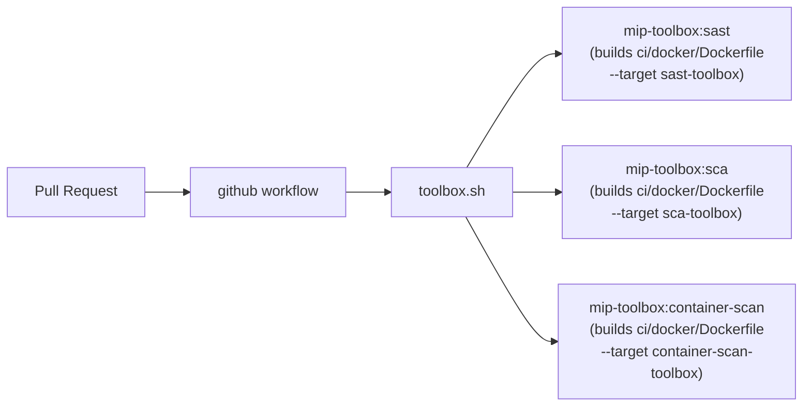

# DevSecOps Security Pipelines

Automated security scanning that runs identically on your laptop, in CI, or in any
Dockerized environment. Following the OWASP DevSecOps model, scanning is split into
three independent pipelines, each with its own orchestrator script and gate.

All three pipelines are dockerized behind a single `Makefile` plus a thin wrapper,
`toolbox.sh`. The Makefile is the primary, recommended interface -- it delegates to
`toolbox.sh`, which builds one purpose-built Docker image per pipeline and runs the
scan inside an ephemeral container (`--rm`). Nothing lingers, nothing leaks between
pipelines, and there is **no shared state** between them.

| Pipeline | Orchestrator | Scans | Tools | Image target |
|---|---|---|---|---|
| **Container Scanning** | `ci/container_scan.py` | The built Docker image + the Dockerfile | Trivy, OSV-Scanner (image CVEs). Hadolint, OpenGrep (Dockerfile SAST) | `container-scan-toolbox` |
| **SCA** (Software Composition Analysis) | `ci/sca_scan.py` | Application dependencies, via SBOM | Trivy, OSV-Scanner | `sca-toolbox` |
| **SAST** (Static Application Security Testing) | `ci/sast_scan.py` | Application source code | OpenGrep | `sast-toolbox` |

The orchestrator scripts and `ci/setup-tools.sh` are unchanged from the original
native-runner implementation -- only how they are packaged, installed, and invoked
has changed (now Docker).

## Table of Contents

- [1. Repository layout](#1-repository-layout)
- [2. Architecture](#2-architecture)
- [3. Usage -- via the `Makefile` (recommended)](#3-usage--via-the-makefile-recommended)
- [4. Usage -- via `toolbox.sh` directly](#4-usage--via-toolboxsh-directly)
- [5. Tool installation (`setup-tools.sh`)](#5-tool-installation-setup-toolssh)
- [6. Pipeline: Container Scanning](#6-pipeline-container-scanning)
- [7. Pipeline: Software Composition Analysis (SCA)](#7-pipeline-software-composition-analysis-sca)
- [8. Pipeline: Static Application Security Testing (SAST)](#8-pipeline-static-application-security-testing-sast)
- [9. Gate status reference](#9-gate-status-reference)
- [10. Suppressing a false positive](#10-suppressing-a-false-positive)

## 1. Repository layout

```
.
├── .github/
│   └── workflows/                      # native-runner CI: thin wrappers calling toolbox.sh
│       ├── container-scan.yml
│       ├── sca.yml
│       └── sast.yml
├── ci/
│   ├── setup-tools.sh                  # installs trivy, osv-scanner, opengrep, hadolint, semgrep-rules
│   ├── container_scan.py               # orchestrator for container-scan
│   ├── sca_scan.py                     # orchestrator for sca
│   ├── sast_scan.py                    # orchestrator for sast
│   ├── parse_sarif.py                  # shared: reads SARIF security-severity scores
│   ├── suppress_trivy.yaml             # shared Trivy ignore file
│   ├── suppress_osv_scanner.toml       # shared OSV-Scanner ignore file
│   └── docker/                         # <- dockerization lives here
│       ├── Dockerfile                  # ONE multi-stage file, one build target per pipeline
│       ├── .dockerignore
│       ├── entrypoints/
│       │   └── sca-entrypoint.sh       # generates SBOM, then runs sca_scan.py
│       └── env/
│           ├── sast.env                # runtime env overrides for the SAST image
│           ├── sca.env                 # runtime env overrides for the SCA image
│           └── container-scan.env      # runtime env overrides for the container-scan image
├── test-mip-maven/                     # example scanned service (Maven)
│   ├── Dockerfile
│   └── pom.xml
├── test-mip-npm/                       # example scanned service (Node)
│   ├── Dockerfile
│   └── package.json
├── test-golang/                        # example scanned service (Go)
│   ├── Dockerfile
│   └── go.mod
├── test-python/                        # example scanned service (Python)
│   └── requirements.txt
├── toolbox.sh                          # docker build/run wrapper: one dedicated container per pipeline
├── Makefile                            # convenience: make sast / sca / container-scan
└── README.md
```

> All three CI workflows trigger on `pull_request`, `workflow_dispatch`, and a
> weekly Monday 02:00 UTC schedule. Each runs independently and has its own gate.
> SARIF findings are uploaded to the GitHub Security tab.

## 2. Architecture



`toolbox.sh` builds one dedicated image per pipeline (a distinct multi-stage target in
`ci/docker/Dockerfile`), then runs the orchestrator script inside an ephemeral
`docker run --rm` container. Each image installs only the tools its pipeline needs, and
each pipeline's env vars live in its own file under `ci/docker/env/` -- changing SCA's
`SBOM_ECOSYSTEM` can never affect SAST's `OPENGREP_EXCLUDE`.

Docker layer caching makes reruns fast after the first build.

## 3. Usage -- via the `Makefile` (recommended)

The `Makefile` is the primary interface. Every target delegates to `toolbox.sh`,
which builds the pipeline's image on first use (cached thereafter) and runs the scan.

```bash
# SAST -- scan a project's source code
make sast PROJECT=./test-mip-maven

# SCA -- scan a project's dependencies (requires the ecosystem)
make sca PROJECT=./test-mip-maven ECOSYSTEM=maven

# Container scanning -- scan a built image
#   SCAN_TYPE selects the sub-scan: sast (Dockerfile lint) or sca (image CVEs)
make container-scan IMAGE=platform-backend:local SCAN_TYPE=sca PROJECT=./test-mip-maven
make container-scan IMAGE=platform-backend:local SCAN_TYPE=sast PROJECT=./test-mip-maven
```

| Target | Required variables | Description |
|---|---|---|
| `make sast` | `PROJECT` | Runs OpenGrep SAST against the project directory |
| `make sca` | `PROJECT`, `ECOSYSTEM` | Resolves deps, generates SBOM, scans with Trivy + OSV-Scanner. `ECOSYSTEM` is one of `maven`, `npm`, `python`, `golang`, `generic`, `none` (default `generic`) |
| `make container-scan` | `IMAGE`, `SCAN_TYPE` | `SCAN_TYPE=sast` lints the Dockerfile; `SCAN_TYPE=sca` scans the already-built image |
| `make clean` | _none_ | Removes local SARIF outputs and the three `mip-toolbox:*` images |

All variables can be overridden on the command line. Defaults: `PROJECT=.`,
`ECOSYSTEM=generic`, `SCAN_TYPE=` (empty -- you must choose `sast` or `sca` for
container-scan).

## 4. Usage -- via `toolbox.sh` directly

`toolbox.sh` is the wrapper behind the Makefile. You only need it directly if you
want to bypass `make`.

```bash
# SAST
./toolbox.sh sast            <project-dir>

# SCA
./toolbox.sh sca             <project-dir> <ecosystem-type>

# Container scanning
./toolbox.sh container-scan  <image-name> <sast|sca> [project-dir]
```

Examples:

```bash
./toolbox.sh sast            ./test-mip-maven
./toolbox.sh sca             ./test-mip-maven maven
./toolbox.sh container-scan  platform-backend:local sast ./test-mip-maven
./toolbox.sh container-scan  platform-backend:local sca
```

Each invocation is its own `docker run --rm` -- nothing to clean up, nothing shared
between runs. Images build automatically on first use.

### Container Scanning and Docker-outside-of-Docker

Container Scanning (the `sca` scan type) runs `docker build` against the mounted project
and `trivy image` against the resulting image. It does this by bind-mounting the host's
`/var/run/docker.sock` into the toolbox container (Docker-outside-of-Docker), so you
**must build the image first** on the host before invoking a `container-scan` `sca`:

```bash
docker build -t platform-backend:local ./test-mip-maven
make container-scan IMAGE=platform-backend:local SCAN_TYPE=sca PROJECT=./test-mip-maven
```

The `sast` scan type lints the Dockerfile itself and does not need the Docker socket --
it only mounts the project directory.

## 5. Tool installation (`setup-tools.sh`)

`ci/setup-tools.sh` installs the security tools inside the Docker images at build time
(you do not normally run it manually). It can also be used standalone on a native runner.

```bash
bash ci/setup-tools.sh --install-tool <tool1,tool2,...|all> [--sbom-ecosystem maven|npm|none]
```

| Tool | Installed from | Used by |
|---|---|---|
| `trivy` | official release tarball, SHA256-pinned | Container Scanning (sca), SCA |
| `osv-scanner` | GitHub release binary, SHA256-pinned | Container Scanning (sca), SCA |
| `opengrep` | GitHub release binary, SHA256-pinned | Container Scanning (sast), SAST |
| `hadolint` | GitHub release binary, SHA256-pinned | Container Scanning (sast) |
| `semgrep-rules` | cloned from `semgrep/semgrep-rules` at a pinned commit | Container Scanning (sast), SAST |

`--sbom-ecosystem maven` (or `npm`/`python`/`golang`) generates `target/bom.json`
after installing the tools. `container-scan` scans the built image directly and needs
no SBOM.

All tool versions and SHA256 checksums are pinned at the top of the script (with
`# renovate:` markers so Renovate bumps version + checksum together). The script stops
and prints the failing line/command on any error rather than continuing silently.

## 6. Pipeline: Container Scanning

`ci/container_scan.py` is driven by a `--scan-type` flag and is invoked twice by the
Docker entrypoint (`ci/docker/Dockerfile` -> `container-scan-toolbox` stage):

- **`--scan-type sast`** -- runs **Hadolint** and **OpenGrep** against the `Dockerfile`
  in `/workspace` (bad practices, missing pinning, insecure instructions).
- **`--scan-type sca`** -- runs **Trivy** and **OSV-Scanner** against the
  *already-built image* (OS packages, image layers).

```
$ python3 ci/container_scan.py --help
usage: sec-orchestrator [-h] [-s {sast,sca}] [-i IMAGE] [--merge-sarif SARIF_FILE [SARIF_FILE ...]] [--merge-output MERGE_OUTPUT]
```

The CI workflow builds the image, then runs both scan types and finally merges all
SARIF reports into one artifact.

## 7. Pipeline: Software Composition Analysis (SCA)

Scans **application dependencies**, not the container image. The SCA entrypoint
(`ci/docker/entrypoints/sca-entrypoint.sh`) resolves the project's dependencies,
generates an SBOM (CycloneDX), and then runs `ci/sca_scan.py`, which scans that SBOM
with **Trivy** and **OSV-Scanner**.

```bash
# Via Makefile (recommended)
make sca PROJECT=./test-mip-maven ECOSYSTEM=maven
```

The `ECOSYSTEM` must match the project type so the correct SBOM generator is used:
`maven`, `npm`, `python`, `golang`, `generic` (Trivy filesystem fallback), or `none`
(skip SBOM generation).

## 8. Pipeline: Static Application Security Testing (SAST)

Scans **source code** with **OpenGrep**. The orchestrator runs OpenGrep twice: once to
write the full SARIF report, and once as the actual gate (same command, with
`--severity=ERROR --error` flags).

```bash
# Via Makefile (recommended)
make sast PROJECT=./test-mip-maven
```

## 9. Gate status reference

Two different gate models are in play, depending on whether a tool reports **CVE
severity** or **rule severity**:

### CVSS-score gate (SCA tools: Trivy, OSV-Scanner; for both container-image and SBOM scans)

`ci/parse_sarif.py:evaluate()` reads the `security-severity` property of each SARIF
result and takes the **highest score across all results**:

| Status | Meaning | Blocks the pipeline? |
|---|---|---|
| `PASSED` | Highest score < 5.0 | No |
| `WARNING` | Highest score 5.0 to 7.9 | No (logged only) |
| `FAILED` | Highest score >= 8.0 | **Yes** |
| `ERROR` | Tool crashed / SARIF missing | **Yes** |

### Rule-severity gate (SAST tools: OpenGrep, Hadolint)

Each tool's own severity threshold decides the status directly:

| Status | Meaning | Blocks the pipeline? |
|---|---|---|
| `PASSED` | No error-severity findings | No |
| `FAILED` | Error-severity findings present | **Yes** |
| `ERROR` | Tool did not run correctly | **Yes** |

All pipelines write SARIF files (uploaded to the GitHub Security tab in CI, and also
plain JSON you can inspect locally). To browse a SARIF file locally, drop it into a
viewer such as [Microsoft's SARIF Web Component](https://microsoft.github.io/sarif-web-component/).

## 10. Suppressing a false positive

Suppression applies to the **CVSS-score tools** (Trivy, OSV-Scanner) and is shared
across Container Scanning and SCA, since both pipelines point at the same two ignore
files (baked into the Docker image at `/app/ci/`).

**Trivy** (`ci/suppress_trivy.yaml`):
```yaml
vulnerabilities:
  - id: CVE-2026-54515
    statement: "Vulnerable code path is not reachable: affected function is dead code in our build."
    expires: 2026-09-30
```

**OSV-Scanner** (`ci/suppress_osv_scanner.toml`):
```toml
[[IgnoredVulns]]
id = "GHSA-5jmj-h7xm-6q6v"
ignoreUntil = 2026-09-30
reason = "Vulnerable function is never called."
```

Refer to the official docs for complete suppression options:
- **Trivy**: [Filtering and ignore files](https://trivy.dev/docs/latest/configuration/filtering/#trivyignoreyaml)
- **OSV-Scanner**: [Ignore vulnerabilities by ID](https://google.github.io/osv-scanner/configuration/#ignore-vulnerabilities-by-id)

OpenGrep / Hadolint findings (SAST) are not suppressed through a shared ignore file;
handle those at the rule/finding level instead.
