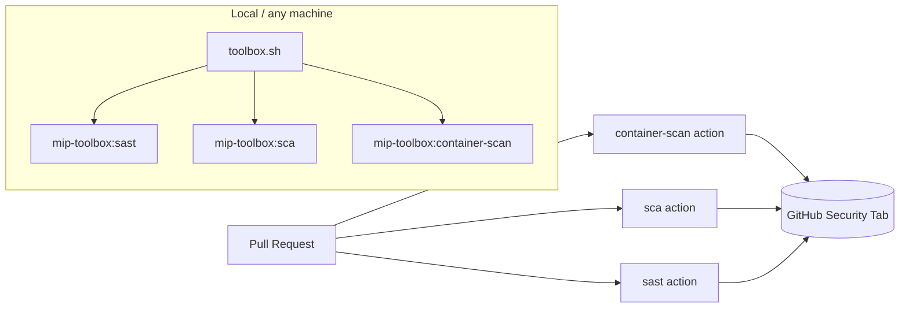

# DevSecOps Security Pipelines

Automated security scanning enforced during CI to block known vulnerabilities and insecure code before merge, automatically on Pull Requests -- and, as of this revision, fully dockerized so the exact same scans run identically on your laptop, on GitHub-hosted runners, on self-hosted runners, or vendored into a completely different repository.

Following the OWASP DevSecOps model, scanning is split into three independent pipelines, each with its own orchestrator script and gate:

| Pipeline | Orchestrator | Scans | Tools |
|---|---|---|---|
| **Container Scanning** | `ci/container_scan.py` | The built Docker image + the Dockerfile | Trivy, OSV-Scanner (image CVEs) . Hadolint, OpenGrep (Dockerfile SAST) |
| **SCA** (Software Composition Analysis) | `ci/sca_scan.py` | Application dependencies, via SBOM | Trivy, OSV-Scanner |
| **SAST** (Static Application Security Testing) | `ci/sast_scan.py` | Application source code | OpenGrep |

**What's new in this revision:** the three pipelines are now dockerized as three independent, purpose-built images (no more one giant image with every tool and every pipeline's env vars fighting for the same namespace), and exposed as reusable **composite GitHub Actions** any repository can call directly, alongside the existing native-runner workflows in this repo. The orchestrator scripts themselves (`ci/*.py`, `ci/setup-tools.sh`) are unchanged from the original implementation.

## Table of Contents

- [1. Repository layout](#1-repository-layout)
- [2. Architecture](#2-architecture)
- [3. Local Docker toolbox (`toolbox.sh`)](#3-local-docker-toolbox-toolboxsh)
- [4. Composite GitHub Actions (reusable from any repo)](#4-composite-github-actions-reusable-from-any-repo)
- [5. Tool installation (`setup-tools.sh`)](#5-tool-installation-setup-toolssh)
- [6. Pipeline: Container Scanning](#6-pipeline-container-scanning)
- [7. Pipeline: Software Composition Analysis (SCA)](#7-pipeline-software-composition-analysis-sca)
- [8. Pipeline: Static Application Security Testing (SAST)](#8-pipeline-static-application-security-testing-sast)
- [9. Gate status reference](#9-gate-status-reference)
- [10. Suppressing a false positive](#10-suppressing-a-false-positive)

## 1. Repository layout

```
.
├── .github/
│   ├── actions/                        # composite actions -- reusable from ANY repo
│   │   ├── sast/action.yml
│   │   ├── sca/action.yml
│   │   └── container-scan/action.yml
│   └── workflows/                      # this repo's own CI, thin wrappers around the actions above
│       ├── sast.yml
│       ├── sca.yml
│       └── container-scan.yml
├── ci/
│   ├── setup-tools.sh                  # installs trivy, osv-scanner, opengrep, hadolint, semgrep-rules
│   ├── container_scan.py               # orchestrator for container-scan
│   ├── sca_scan.py                     # orchestrator for sca
│   ├── sast_scan.py                    # orchestrator for sast
│   ├── parse_sarif.py                  # shared: reads SARIF security-severity scores
│   ├── suppress_trivy.yaml             # shared Trivy ignore file
│   ├── suppress_osv_scanner.toml       # shared OSV-Scanner ignore file
│   └── docker/                         # <- dockerization lives here
│       ├── Dockerfile                  # ONE multi-stage file, one build target per pipeline
│       ├── docker-compose.yml          # optional declarative alternative to toolbox.sh
│       ├── entrypoints/
│       │   ├── sca-entrypoint.sh
│       │   └── container-scan-entrypoint.sh
│       └── env/
│           ├── sast.env
│           ├── sca.env
│           └── container-scan.env
├── mip-backend-maven/                  # example scanned service
│   ├── Dockerfile
│   └── pom.xml
├── toolbox.sh                          # docker run wrapper: one dedicated container per pipeline
├── Makefile                            # convenience: make sast / sca / container-scan
└── README.md
```

> **Note:** all three workflows trigger on `pull_request`, `workflow_dispatch`, and a weekly Monday 02:00 UTC schedule, and run independently in parallel. Each has its own gate and its own category in the GitHub Security tab.

## 2. Architecture



Both the GitHub Actions path and the local Docker path (`toolbox.sh`) call the exact same three orchestrator scripts under `ci/` -- there is one source of truth for what "passing" means, whether you run it in CI or on your laptop before pushing.

## 3. Local Docker toolbox (`toolbox.sh`)

### The problem this replaces

A single long-lived "do everything" toolbox container is fine until you have three pipelines that each want different tools and (sometimes colliding) env vars baked into the same image:

```bash
# what NOT to do anymore -- one container, one image, three pipelines'
# worth of env vars all fighting for the same namespace:
docker run -d --name toolbox -v "$PWD/MIP-backend-test:/workspace" \
  -w /workspace image:test sleep infinity
docker exec -it toolbox bash
```

### The fix: one image + one dedicated, ephemeral container per pipeline

`ci/docker/Dockerfile` is a single multi-stage file with one build **target** per pipeline (`sast-toolbox`, `sca-toolbox`, `container-scan-toolbox`), each installing only the tools it needs and declaring only its own env vars (full rationale in the comments at the top of that file). `toolbox.sh` wraps `docker build --target ...` / `docker run --rm ...` so you never type the raw commands:

```bash
# Build all three images (or just one: ./toolbox.sh build sast)
./toolbox.sh build all

# Run a pipeline against a project directory -- each is its own
# `docker run --rm`, so nothing lingers and nothing leaks between pipelines
./toolbox.sh sast ./mip-backend-golang
./toolbox.sh sca ./mip-backend-maven
./toolbox.sh container-scan ./mip-backend-maven platform-backend:local

# Drop into a debug shell inside a given pipeline's toolbox instead of
# running the scan
./toolbox.sh shell sca ./mip-backend-maven
```

Or the same thing via `make`:

```bash
make build
make sast PROJECT=./mip-backend-golang
make sca PROJECT=./mip-backend-maven
make container-scan PROJECT=./mip-backend-maven IMAGE=platform-backend:local
```

Or declaratively via `docker compose` if you'd rather wire this into an existing compose-based dev stack:

```bash
PROJECT_DIR=./mip-backend-maven docker compose -f ci/docker/docker-compose.yml run --rm sca
```

**Container Scanning specifically** needs to run `docker build` against the mounted project, which it does via **Docker-outside-of-Docker**: the host's `/var/run/docker.sock` is bind-mounted into the toolbox container instead of running a nested daemon. `toolbox.sh` detects the socket's GID and passes `--group-add` automatically so the non-root `toolbox` user inside the container can use it.

### Why per-pipeline env files instead of one shared `.env`

`ci/docker/env/{sast,sca,container-scan}.env` are runtime overrides on top of the build-time `ENV` defaults already baked into each image target. Because each pipeline has its own file, changing SCA's `SBOM_ECOSYSTEM` can never accidentally affect SAST's `OPENGREP_EXCLUDE` -- they're not even in the same container.

## 4. Composite GitHub Actions (reusable from any repo)

`.github/actions/{sast,sca,container-scan}/action.yml` package each pipeline as a standalone [composite action](https://docs.github.com/en/actions/creating-actions/creating-a-composite-action). Each one:

1. Checks out **this** toolkit repo into `.devsecops-toolkit/` at a pinned `toolkit-ref`, so the caller never has to vendor `ci/*.py` or `setup-tools.sh` themselves, and the toolkit can be versioned independently of every repo that consumes it.
2. Installs only the tools that pipeline needs.
3. Runs the relevant orchestrator script against the caller's own checked-out source.
4. Uploads SARIF to the Security tab + as a build artifact.

**Using them from this repo** (see `.github/workflows/*.yml`) -- `toolkit-repository`/`toolkit-ref` default to `github.repository` / `github.sha`, i.e. "this repo, at this commit", so no extra inputs are needed:

```yaml
- uses: actions/checkout@v6
- uses: ./.github/actions/sast
```

**Using them from a different repository** -- publish/tag this repo (e.g. `v1.0.0`) and pin to it explicitly:

```yaml
name: Security
on: [pull_request]
jobs:
  sast:
    runs-on: ubuntu-latest
    permissions: { contents: read, security-events: write }
    steps:
      - uses: actions/checkout@v6
      - uses: your-org/mip-devsecops-pipelines/.github/actions/sast@v1.0.0
        with:
          toolkit-repository: your-org/mip-devsecops-pipelines
          toolkit-ref: v1.0.0

  sca:
    runs-on: ubuntu-latest
    permissions: { contents: read, security-events: write }
    steps:
      - uses: actions/checkout@v6
      - uses: your-org/mip-devsecops-pipelines/.github/actions/sca@v1.0.0
        with:
          toolkit-repository: your-org/mip-devsecops-pipelines
          toolkit-ref: v1.0.0
          project-directory: backend
          sbom-ecosystem: maven

  container-scan:
    runs-on: ubuntu-latest
    permissions: { contents: read, security-events: write }
    steps:
      - uses: actions/checkout@v6
      - uses: your-org/mip-devsecops-pipelines/.github/actions/container-scan@v1.0.0
        with:
          toolkit-repository: your-org/mip-devsecops-pipelines
          toolkit-ref: v1.0.0
          project-directory: backend
          image-name: my-service:ci
```

> Replace `your-org/mip-devsecops-pipelines` with this repo's real `owner/name` once pushed, and tag a release (e.g. `git tag v1.0.0 && git push --tags`) so external callers pin to something stable instead of a moving branch.

**On self-hosted runners without the toolchain preinstalled**, you can point the same runner at `toolbox.sh`/`ci/docker/Dockerfile` instead of the native-install composite actions above, trading a slightly longer first run (image build, cached after) for zero dependency on what's preinstalled on the runner image.

## 5. Tool installation (`setup-tools.sh`)

```bash
bash ci/setup-tools.sh --install-tool <tool1,tool2,...|all> [--sbom-ecosystem maven|npm|none]
```

`--install-tool` accepts a comma-separated list (or `all`):

| Tool | Installed from | Used by |
|---|---|---|
| `trivy` | official release tarball, SHA256-pinned | Container Scanning (sca), SCA |
| `osv-scanner` | GitHub release binary, SHA256-pinned | Container Scanning (sca), SCA |
| `opengrep` | GitHub release binary, SHA256-pinned | Container Scanning (sast), SAST |
| `hadolint` | GitHub release binary, SHA256-pinned | Container Scanning (sast) |
| `semgrep-rules` | cloned from `semgrep/semgrep-rules` at a pinned commit | Container Scanning (sast), SAST |

`--sbom-ecosystem maven` generates `target/bom.json` afterward. `container-scan` scans the built image directly and needs no SBOM.

All tool versions and SHA256 checksums are pinned at the top of the script (with `# renovate:` markers so Renovate bumps version + checksum together). The script stops and prints the failing line/command on any error rather than continuing silently. **This file and every `ci/*.py` orchestrator are unmodified from the original implementation** -- only how they're packaged, installed, and invoked has changed.

## 6. Pipeline: Container Scanning

`container_scan.py` builds the Docker image once, then runs twice against it, once per `--scan-type`:

- **`--scan-type sast`** -> runs **Hadolint** and **OpenGrep** against the `Dockerfile` itself (bad practices, missing pinning, insecure instructions).
- **`--scan-type sca`** -> runs **Trivy** and **OSV-Scanner** against the *built image* (OS packages, layers).

```
$ python3 ci/container_scan.py --help
usage: sec-orchestrator [-h] [-s {sast,sca}] [-i IMAGE] [--merge-sarif SARIF_FILE [SARIF_FILE ...]] [--merge-output MERGE_OUTPUT]
```

**Running it locally (three equivalent ways):**
```bash
# 1. toolbox.sh (recommended)
./toolbox.sh container-scan ./mip-backend-maven platform-backend:local

# 2. docker compose
PROJECT_DIR=./mip-backend-maven docker compose -f ci/docker/docker-compose.yml run --rm container-scan

# 3. bare metal, same as before
docker build -t app:local .
bash ci/setup-tools.sh --install-tool trivy,osv-scanner,opengrep,hadolint,semgrep-rules
python ci/container_scan.py --scan-type sast
python ci/container_scan.py --scan-type sca --image app:local
```

## 7. Pipeline: Software Composition Analysis (SCA)

Scans **application dependencies**, not the container. Resolves the Maven dependency tree, generates an SBOM (CycloneDX), and scans that SBOM with **Trivy** and **OSV-Scanner**.

**Running it locally:**
```bash
# 1. toolbox.sh (resolves deps + generates SBOM against the mounted project automatically)
./toolbox.sh sca ./mip-backend-maven

# 2. bare metal, same as before
mvn dependency:resolve -q
bash ci/setup-tools.sh --install-tool trivy,osv-scanner --sbom-ecosystem maven
python ci/sca_scan.py
```

## 8. Pipeline: Static Application Security Testing (SAST)

Scans **source code** (not the Dockerfile, not dependencies) with **OpenGrep**. `run_opengrep()` runs twice: once to write the full SARIF report, once as the actual gate, using the same command both times with different flags.

**Running it locally:**
```bash
./toolbox.sh sast ./mip-backend-golang
# or bare metal:
bash ci/setup-tools.sh --install-tool opengrep,semgrep-rules
python ci/sast_scan.py
```

## 9. Gate status reference

Two different gate models are in play, depending on whether a tool reports **CVE severity** or **rule severity**:

### CVSS-score gate (SCA tools: Trivy, OSV-Scanner; both container-image and SBOM scans)

`parse_sarif.evaluate()` reads the `security-severity` property of each SARIF result and takes the **highest score across all results**:

| Status | Meaning | Blocks the pipeline? |
|---|---|---|
| `PASSED` | Highest score < 5.0 | No |
| `WARNING` | Highest score 5.0 to 7.9 | No (logged only) |
| `FAILED` | Highest score >= 8.0 | **Yes** |
| `ERROR` | Tool crashed / SARIF missing | **Yes** |

### Rule-severity gate (SAST tools: OpenGrep, Hadolint)

Each tool's own severity threshold (`--severity=ERROR --error` for OpenGrep, `--failure-threshold error` for Hadolint) decides the status directly:

| Status | Meaning | Blocks the pipeline? |
|---|---|---|
| `PASSED` | No error-severity findings | No |
| `FAILED` | Error-severity findings present | **Yes** |
| `ERROR` | Tool did not run correctly | **Yes** |

All three pipelines write their findings as SARIF files, uploaded to the GitHub Security tab, but they're also plain JSON you can inspect directly. To browse a SARIF file locally without the Security tab, drop it into a viewer such as [Microsoft's SARIF Web Component](https://microsoft.github.io/sarif-web-component/).

## 10. Suppressing a false positive

Suppression applies to the **CVSS-score tools** (Trivy, OSV-Scanner) and is shared across Container Scanning and SCA, since both point at the same two ignore files.

**Trivy** (`ci/suppress_trivy.yaml`):
```yaml
vulnerabilities:
  - id: CVE-2026-54515
    statement: "Vulnerable code path is not reachable: affected function is dead code in our build (compiled out via CGO_ENABLED=0), confirmed by static analysis."
    expires: 2026-09-30
```

**OSV-Scanner** (`ci/suppress_osv_scanner.toml`):
```toml
[[IgnoredVulns]]
id = "GHSA-5jmj-h7xm-6q6v"
ignoreUntil = 2026-09-30
reason = "Vulnerable function is never called."
```

Refer to the official docs for complete suppression options:
- **Trivy**: [Filtering and ignore files](https://trivy.dev/docs/latest/configuration/filtering/#trivyignoreyaml)
- **OSV-Scanner**: [Ignore vulnerabilities by ID](https://google.github.io/osv-scanner/configuration/#ignore-vulnerabilities-by-id)

OpenGrep/Hadolint findings (SAST) aren't suppressed through a shared ignore file in this setup; handle those at the rule/finding level instead.
